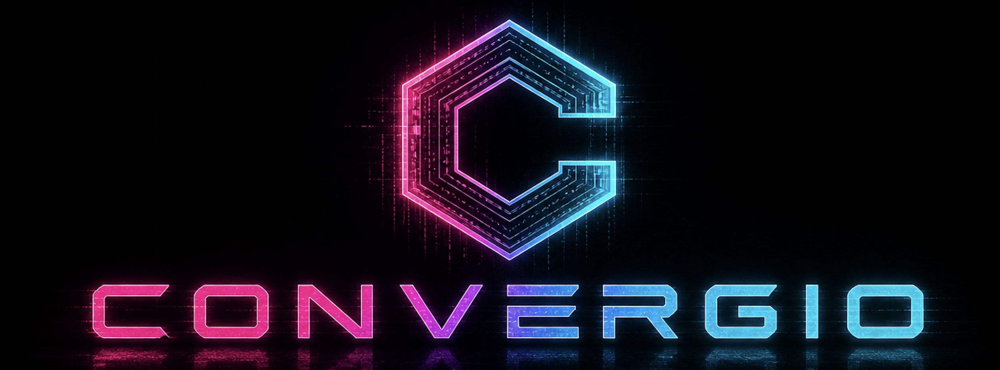
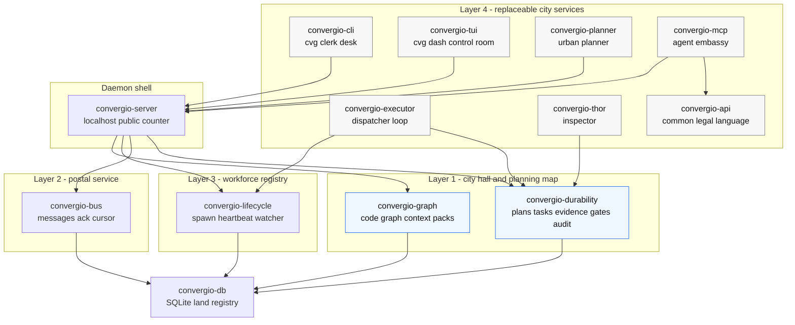

<p align="center">
  
</p>

<p align="center"><strong>Convergio — Make machines prove it.</strong><br>
<em>The machine that builds machines — and proves they work.</em></p>

# Convergio

> **Convergio is a personal open-source project.** It is not a Microsoft
> product, not affiliated with Microsoft, and not endorsed by Microsoft.
> References to the
> [ISE Engineering Fundamentals Playbook](https://microsoft.github.io/code-with-engineering-playbook/ISE/)
> (CC BY 4.0) and to [`microsoft/hve-core`](https://github.com/microsoft/hve-core)
> (MIT) are use of those projects under their public licences and reflect
> the author's reading of public documentation, not any internal
> position of any organisation. References to
> [`garrytan/gstack`](https://github.com/garrytan/gstack) (MIT) are
> likewise public-licence use, with a courtesy-notice obligation
> documented in [ADR-0019](./docs/adr/0019-thinking-stack-gstack-vendored.md).

[](https://github.com/Roberdan/convergio/actions/workflows/ci.yml)
[](https://github.com/Roberdan/convergio/actions/workflows/release.yml)
[](https://github.com/Roberdan/convergio/blob/main/LICENSE)
[](https://www.rust-lang.org/)
[](#)

> **Make machines prove it.** The machine that builds machines —
> and proves they work. A local daemon that refuses agent work
> whose evidence does not match the claim of done, and writes
> every refusal to a hash-chained audit log.

Convergio runs on your machine, sits between your agent runner and
your codebase, and applies server-side gates to every `submitted` /
`done` transition. When the evidence the agent attaches contains
debt markers, scaffolding tells, non-clean build signals, or
credential leaks, Convergio returns 409 and records the refusal in
an audit chain you can verify from outside.

It is not an agent framework and it is not a cloud service. Bring
your own agent runner (Claude Code, a Python loop, a shell script).
Convergio gives that runner a durable local source of truth, a gate
pipeline, and a mergeable coordination layer so multiple agents can
work in parallel without silently corrupting state, Git, or the
filesystem.

Convergio also offers *optional* capability bundles that an
operator may install for convenience — for example, a
thinking-stack capability that wraps community planning skills
(see [ADR-0019](./docs/adr/0019-thinking-stack-gstack-vendored.md)).
These are opt-in conveniences for the operator, not a substitute
for the user's own runner; the "bring your own runner" position
above is unchanged.

The honest mechanism, in one line: Convergio cannot make an agent
truthful, but it raises the cost of lying and makes every refusal
non-falsifiable.

**Where Convergio sits in the engineering-fundamentals landscape:**
the [ISE Engineering Fundamentals Playbook](https://microsoft.github.io/code-with-engineering-playbook/ISE/)
prescribes engineering practices in checklists; community projects
like [`microsoft/hve-core`](https://github.com/microsoft/hve-core)
transmit such practices to Copilot agents via prompts and skills.
Convergio is the runtime enforcer of the principles ISE
Engineering Fundamentals describes in checklists and hve-core
transmits via Copilot prompts: gates that refuse with HTTP 409,
an audit chain that proves the refusal, an OODA loop that lets
agent and validator converge or escalate. See
[ADR-0017](./docs/adr/0017-ise-hve-alignment.md) for the mapping.
Convergio remains a personal project (see disclaimer above), not a
Microsoft offering — the alignment is technical, not
organisational.

**Why we exist:** see [`docs/vision.md`](./docs/vision.md) for the
long-tail thesis and the urbanism frame (Convergio is an urban
code, not a master plan — Le Corbusier modularity + Jane Jacobs
emergence). See [`ROADMAP.md`](./ROADMAP.md) for the four waves
that materialise it.

## Why Convergio

The hard failure mode for coding agents is not one bad completion. It is
many agents working at once:

- overwriting the same files;
- diverging across worktrees;
- producing broken merges and noisy CI;
- losing process-local state;
- claiming "done" without evidence.

Convergio's design answer is:

1. durable task/evidence state;
2. hash-chained audit;
3. CRDT-aware multi-actor metadata;
4. workspace resource leases;
5. patch proposals and merge arbitration;
6. server-side gates that refuse unsafe `submitted`/`done` transitions.

All six are implemented in the local runtime. The current release line
also includes signed local capability install/remove, a `planner.solve`
capability action, a constrained local shell runner proof, `shell`,
`claude`, and `copilot` runner kinds, the MCP bridge, the code graph,
the executor loop, and the `cvg dash` terminal dashboard. Remote
capability registry and ACP bridge remain roadmap work.

See [docs/vision.md](./docs/vision.md) for the product vision.

## Principles, and which ones are actually enforced today

The five principles below are the product's identity. Each one carries
an explicit status — `enforced`, `partial`, or `planned` — so the
README does not claim more than the code does.

1. **P1 — Zero tolerance for technical debt, errors and warnings.**
   `enforced`. `NoDebtGate` (7 languages), `NoStubGate`, and
   `ZeroWarningsGate` refuse `submitted`/`done` transitions when
   evidence contains debt markers, scaffolding tells, or non-clean
   build/lint/test signals.
2. **P2 — Security first, local first.** `partial`. Localhost-by-default
   bind, evidence-as-untrusted-input, and `NoSecretsGate` (gitleaks
   pattern set) are shipped. `DepsAuditGate`, `PromptInjectionGate`,
   and HMAC middleware for non-loopback bind remain roadmap.
3. **P3 — Accessibility first.** `planned`. No `A11yGate` yet. CLI
   strives to remain screen-reader friendly without color, but this
   is convention rather than enforcement until the gate ships.
4. **P4 — No scaffolding only.** `enforced` for self-admitted stubs.
   `NoStubGate` refuses evidence that says it is a stub, placeholder,
   skeleton, or not wired. `WireCheckGate` (proves new symbols have
   real callers in the diff) remains roadmap.
5. **P5 — Internationalization first.** `enforced`. CLI user-facing
   strings go through Fluent bundles with English and Italian
   shipped together; a coverage test refuses partial locales.

See [CONSTITUTION.md](./CONSTITUTION.md) for the full rule set, and
[docs/plans/v0.1.x-friction-log.md](./docs/plans/v0.1.x-friction-log.md)
for the gaps the next release will close.

## Quickstart

```bash
sh scripts/install-local.sh
cvg setup

convergio start
```

In another terminal:

```bash
cvg doctor
cvg health
cvg demo
```

Optional daemon service:

```bash
cvg service install
cvg service start
```

For agents:

```bash
cvg setup agent claude   # or cursor, cline, continue, qwen, shell, copilot-local
cvg mcp tail             # inspect bridge diagnostics
```

Agent hosts that support MCP should connect the stdio command
`convergio-mcp`; it exposes only `convergio.help` and `convergio.act`.
See `docs/agents/README.md` for host-specific setup snippets.

Release artifacts can be built locally with `scripts/package-local.sh`
and signed/notarized on macOS with `scripts/sign-macos-local.sh`; see
`docs/release.md`.

Defaults:

- SQLite database: `~/.convergio/v3/state.db`
- HTTP bind: `127.0.0.1:8420`
- No external services
- No account, tenant, or server setup

You can override the local database file when needed:

```bash
convergio start --db sqlite:///tmp/convergio.db?mode=rwc
```

## Manual local loop

```bash
cvg plan create "ship one clean task" --project convergio-local
cvg status
cvg task list <plan_id>
cvg task transition <task_id> in-progress --agent-id local-agent
cvg evidence add <task_id> --kind code --payload '{"diff":"fn main() {}"}' --exit-code 0
cvg evidence add <task_id> --kind test --payload '{"warnings_count":0,"errors_count":0,"failures":[]}' --exit-code 0
cvg task transition <task_id> submitted --agent-id local-agent
cvg validate <plan_id>
cvg audit verify
```

Use `cvg demo` first: it creates one dirty task that gets refused by the
gates, then one clean plan that validates and verifies the audit chain.

## What you get

Convergio is organised like a city: a stable civil code in the lower
layers, public infrastructure in the middle, and replaceable services at
the edge. Each crate has one civic role, one owner boundary, and one
reason to exist.

| Crate | Civic role | What it does | Platform value | Principle alignment |
|-------|------------|--------------|----------------|---------------------|
| `convergio-db` | Land registry | Opens the SQLite pool and runs per-crate migrations. | Gives every layer one local, durable substrate. | P2 local-first, P1 predictable schema. |
| `convergio-durability` | City hall + code enforcement | Owns plans, tasks, evidence, audit chain, gates, CRDT/workspace coordination, reaper and capability registry. | Makes work durable, reviewable and rejectable instead of conversational. | P1 gates, P2 audit/security, P4 no scaffolding, P5 evidence for localized surfaces. |
| `convergio-bus` | Postal service | Persists plan-scoped topic/direct messages and acknowledgements. | Lets agents coordinate without hidden process memory. | P2 durable local communication, P4 fully wired collaboration. |
| `convergio-lifecycle` | Workforce registry | Spawns agents, records heartbeats, watches process exit state. | Keeps agent work attached to real processes and recoverable leases. | P2 controlled local execution, P1 observable failures. |
| `convergio-graph` | Planning office map | Builds a code graph and produces task-scoped context packs. | Gives agents narrower, evidence-backed context instead of whole-repo flooding. | P1 less drift, P2 reduced prompt-injection surface, P4 wired context. |
| `convergio-server` | Public counter | Exposes the localhost HTTP API and wires the daemon loops. | One stable front door for CLI, MCP and custom runners. | P2 localhost by default, P4 routes cannot bypass gates. |
| `convergio-cli` | Clerk desk | Provides the `cvg` human/admin client over HTTP. | Lets operators inspect, drive and repair the local runtime. | P3 accessible terminal UX, P5 localized output where surfaced. |
| `convergio-tui` | Control room | Powers `cvg dash`, a read-only four-pane terminal dashboard. | Makes plans, tasks, agents and PRs visible without changing daemon state. | P3 terminal-first visibility, P2 read-only observer boundary. |
| `convergio-i18n` | Translation office | Loads Fluent bundles and tests locale coverage. | Keeps user-facing CLI strings English + Italian from day one. | P5 enforced. |
| `convergio-api` | Common legal language | Defines the stable agent action schema and schema version. | Keeps MCP/agent clients synchronized with daemon capabilities. | P1 contract tests, P4 no drift between protocol and implementation. |
| `convergio-mcp` | Embassy | Bridges MCP hosts to `convergio.help` and `convergio.act`. | Lets external agents use Convergio without learning every HTTP route. | P2 constrained tool surface, P4 action dispatch sync. |
| `convergio-planner` | Urban planner | Turns a mission into a structured plan. | Provides a reference planning flow on top of the core runtime. | P4 plans become executable tasks, not prose only. |
| `convergio-executor` | Dispatcher | Claims ready tasks and spawns configured agents; also runs as a daemon loop. | Moves ready work forward without manual polling while keeping `cvg dispatch` as a test seam. | P1 observable dispatch, P2 supervised execution, P4 fully wired Layer 4. |
| `convergio-thor` | Inspector | Validates submitted tasks and is the only component allowed to mark work `done`. | Separates "agent says done" from "system accepts done". | P1/P2/P4 final gatekeeping. |

Layer 4 is intentionally replaceable. The product value is the local
runtime and its gates; your own agent client can call the HTTP API
directly or use the MCP bridge.



## Project status

**Current scope - local-first SQLite runtime.**

Current scope:

- SQLite-only local runtime
- localhost HTTP API
- `cvg status` snapshot dashboard for active plans and recently completed work
- `cvg dash` interactive TUI (4-pane htop-style: plans, active tasks, agents, PRs — ADR-0029)
- hash-chained audit verification
- server-side quality gates
- common local secret-leak refusal
- persistent local message bus
- task context packets and plan-scoped bus actions for MCP agents
- CRDT actor/op schema, deterministic import/merge and conflict surfacing
- workspace leases, patch proposals and merge queue arbitration
- process spawn/heartbeat/watcher and local shell runner proof
- local capability registry, Ed25519 package signature verification, and
  signed local `install-file`/remove
- `planner.solve` as the first installed capability-gated action
- deterministic reference planner, executor tick, Thor validator and
  guided demo
- English/Italian CLI messages for the localized surfaces

Out of scope for this MVP:

- remote multi-user deployment
- account, tenant, or RBAC model
- hosted graphical UI
- hosted service
- agent marketplace

The workspace test suite covers the local runtime, gates, audit tamper
detection, CLI smoke behavior, CRDT/workspace flows, MCP actions, and HTTP
E2E workflows.

## Documentation

- [ARCHITECTURE.md](./ARCHITECTURE.md) - layers, API and request lifecycle
- [CONSTITUTION.md](./CONSTITUTION.md) - non-negotiable rules
- [docs/vision.md](./docs/vision.md) - product vision and positioning
- [docs/multi-agent-operating-model.md](./docs/multi-agent-operating-model.md) - how multiple agents coordinate through one daemon
- [ROADMAP.md](./ROADMAP.md) - focused local-first roadmap
- [CONTRIBUTING.md](./CONTRIBUTING.md) - development workflow
- [docs/adr/](./docs/adr/) - architecture decision records

## License

Convergio Community License v1.3 (source-available, not OSI-approved). See [LICENSE](./LICENSE).
